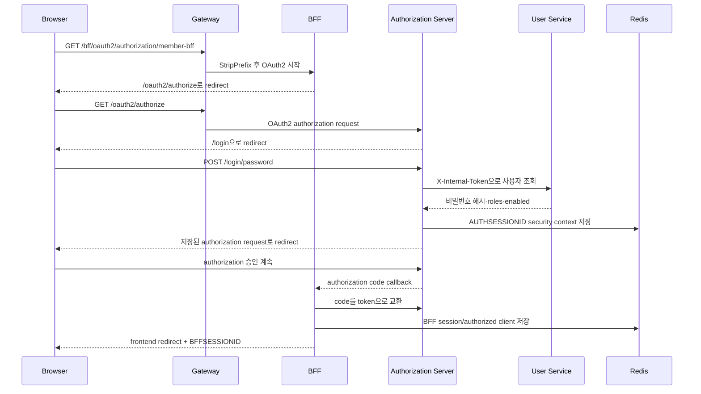

# 인증 흐름

## 원칙

- OAuth2/OIDC Authorization Code 흐름의 client는 브라우저가 아니라 Member/Admin BFF다.
- access token과 refresh token은 서버 측 authorized client 저장소와 Redis-backed session에 연결된다.
- 브라우저는 `BFFSESSIONID` 또는 `ADMINSESSIONID` 세션 쿠키만 사용한다.
- 상태 변경 요청은 BFF별 CSRF 쿠키·헤더 쌍을 요구한다.
- User, Community, Stock Service는 Authorization Server가 발급한 JWT를 검증한다.

## 로그인 순서

관리자 흐름은 `admin-bff` client registration과 `ADMINSESSIONID`를 사용한다. OAuth2 로그인 성공 후 Admin BFF가 `ROLE_ADMIN`을 검사하며 역할이 없으면 BFF 세션을 종료하고 `admin_role_required` 오류로 프런트에 보낸다.

## 비밀번호 로그인

브라우저는 `/login/password`에 `loginId`, `password`를 보낸다. Authorization Server는 User Service 내부 API에서 사용자를 조회하고 BCrypt로 비밀번호를 검사한다. 성공하면 Authorization Server 세션에 `SecurityContext`를 저장하고, 이전 `/oauth2/authorize` 요청이 있으면 그 URL을 반환한다. 프런트는 반환된 URL 또는 BFF OAuth2 시작 URL로 이동한다.

## 인증 상태 확인과 CSRF

| 경계 | 세션 쿠키 | CSRF 쿠키 | CSRF 헤더 |
| --- | --- | --- | --- |
| Member BFF | `BFFSESSIONID` | `MEMBER-XSRF-TOKEN` | `X-MEMBER-XSRF-TOKEN` |
| Admin BFF | `ADMINSESSIONID` | `ADMIN-XSRF-TOKEN` | `X-ADMIN-XSRF-TOKEN` |
| Authorization Server | `AUTHSESSIONID` | Spring Security 기본 정책 | Spring Security 기본 정책 |

`GET /bff/auth/me`와 `GET /admin-bff/auth/me`는 익명 상태에서도 200 응답으로 인증 여부를 돌려주며, 동시에 CSRF token을 접근해 SPA가 사용할 쿠키를 발행한다. 이후 POST/PUT/DELETE 요청은 해당 쿠키 값을 헤더에 복사해야 한다.

## 하위 서비스 호출

BFF는 현재 인증 객체로 `OAuth2AuthorizedClientManager`를 호출한다. access token이 만료됐고 refresh token이 유효하면 갱신한 뒤 Feign 호출의 `Authorization: Bearer ...` 헤더에 넣는다. 브라우저에는 access token이 반환되지 않는다.

JWT에는 `sub`, `user_id`, `login_id`, `email`, `name`, `username`, `roles` claim이 포함된다. Resource Server는 `roles` 값을 `SimpleGrantedAuthority`로 변환한다. User Service의 `/api/user/admin/**`는 `ROLE_ADMIN`을 요구한다.

## 가입과 내부 API

- `POST /bff/registration/member`는 Member BFF가 `ROLE_USER`로 User Service `/internal/users`를 호출한다.
- `POST /admin-bff/registration/admin`은 Admin BFF가 `ROLE_USER`, `ROLE_ADMIN`으로 같은 내부 API를 호출한다.
- 내부 호출에는 `X-Internal-Token`을 사용하고 User Service가 constant-time 비교로 검증한다.

**위험:** 관리자 가입 endpoint가 현재 인증 없이 허용된다. 운영에서는 bootstrap 기간 이후 비활성화하거나, 초대 토큰·기존 관리자 승인·네트워크 제한 중 하나 이상을 적용해야 한다.

## 로그아웃

1. SPA가 BFF logout endpoint를 CSRF 헤더와 함께 호출한다.
2. Member BFF는 presence logout 이벤트를 남기고 BFF session을 무효화한다. Admin BFF도 자신의 session을 무효화한다.
3. BFF는 Authorization Server `/logout` 또는 OIDC end-session URL을 응답한다.
4. 브라우저가 해당 URL로 이동해 `AUTHSESSIONID`를 종료한다.
5. Authorization Server는 허용 목록에 있는 회원/관리자 `/auth` URL로만 redirect한다.

BFF 로그아웃 응답만 받고 Authorization Server URL로 이동하지 않으면 인증 서버 세션이 남아 즉시 재로그인될 수 있다.
