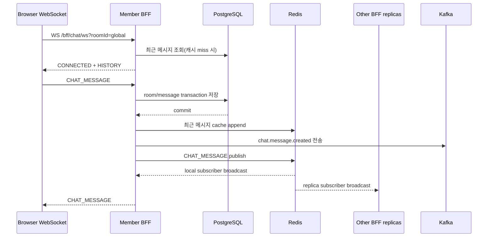

# 채팅 아키텍처

## 현재 구현

채팅은 Member BFF 안에 구현되어 있다. 인증된 BFF session으로 WebSocket에 연결하고, PostgreSQL을 메시지 이력의 기준 저장소로 사용한다. 여러 Member BFF replica 사이의 실시간 fan-out은 Redis pub/sub이 담당하며 Kafka는 알림·분석 이벤트 소비 경로로 사용된다.

## WebSocket 계약

- 내부 handler 경로: `/chat/ws`
- 외부 경로: `/bff/chat/ws?roomId={roomId}`
- 인증: `BFFSESSIONID`가 연결 handshake에 포함되어야 한다.
- client type: `PING`, `CHAT_MESSAGE`
- server type: `CONNECTED`, `HISTORY`, `CHAT_MESSAGE`, `PONG`, `ERROR`
- 메시지 최대 길이: 1,000자
- 기본 history: 50개, 최대 200개

연결 직후 room 등록, `CONNECTED`, 최근 `HISTORY`를 순서대로 보낸다. Redis publish가 실패하면 현재 replica의 local sessions에만 fallback broadcast한다.

## 영속성과 캐시

`chat_rooms.room_id`는 unique이고, `chat_messages`는 room foreign key와 전송 시각 인덱스를 가진다. 채팅 방은 첫 메시지 저장 시 생성된다. 한 JVM 안에서는 생성 lock을 사용하지만 여러 replica의 동시 첫 메시지는 DB unique 제약 충돌 가능성이 있으므로 재조회/retry 처리가 필요하다.

최근 메시지는 Redis list에 최대 200개를 1시간 저장한다. warmed marker가 충분한 cache인지 구분하며, cache miss는 PostgreSQL에서 역순 조회한 뒤 시간순으로 돌려 cache를 채운다. cache 실패는 로그를 남기고 DB 경로로 계속 처리한다.

## Redis pub/sub

채널은 `spring:chat:broadcast`다. 모든 Member BFF replica가 구독하고 자기 JVM의 room session registry에 broadcast한다. pub/sub은 durable queue가 아니므로 연결 순간의 전파에만 사용한다. 재연결 client는 REST 또는 연결 직후 HISTORY로 누락을 복구한다.

## Kafka

| 항목 | 값 |
| --- | --- |
| topic | `spring.chat.message.created` |
| DLT | `spring.chat.message.created.DLT` |
| key | `roomId` |
| partitions | 3 |
| retry | 1초 간격, 설정상 3회 backoff |
| consumer groups | notification, analytics, DLT |

메시지 DB transaction이 commit된 뒤 `ChatMessageSavedEvent` listener가 Kafka로 JSON을 전송한다. notification과 analytics consumer는 현재 이벤트를 로그로 기록하는 예제 수준이다. consumer 처리 실패는 같은 partition의 `.DLT`로 이동한다.

## Outbox 상태

**현재 Outbox는 구현되어 있지 않다.** `AFTER_COMMIT` listener와 비동기 `KafkaTemplate.send` 사이에 프로세스가 종료되거나 브로커가 실패하면 DB에는 메시지가 있지만 Kafka 이벤트는 유실될 수 있다. `ADR-003`의 Outbox는 목표 구조이며 다음이 필요하다.

1. 채팅 메시지와 같은 transaction에서 outbox row 저장
2. relay가 미발행 row를 claim하고 Kafka 전송
3. broker ack 후 published 처리
4. event ID 기반 consumer 멱등성
5. 미발행 건수와 oldest age metric/alert

## 확장과 운영 기준

- WebSocket session은 replica memory에 있으므로 Redis fan-out이 필수다.
- Ingress read/send timeout은 3,600초로 설정되어 있다.
- 순서는 `roomId` Kafka key로 partition 내에서만 보장한다.
- exactly-once를 가정하지 않고 at-least-once + 멱등 consumer를 목표로 한다.
- 부하 테스트는 2 replicas, 인증 cookie, 다중 연결에서 수신 누락·중복·p95/p99를 측정한다.
