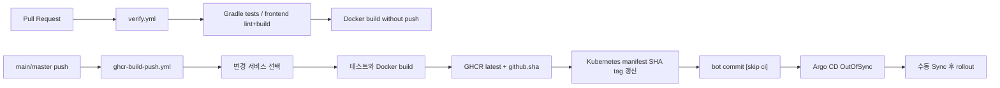
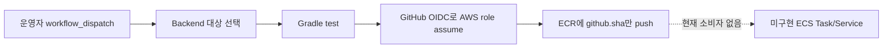

# CI/CD와 배포

## 파이프라인 개요

## 변경 범위 선택

`infra/ci/select-build-matrix.py`가 Git diff를 다음 원칙으로 매핑한다.

- 서비스 디렉터리 변경: 해당 backend image
- `spring-msa-common-web`: Auth, User, Member BFF, Admin BFF
- `spring-msa-common-kafka`: Member BFF
- member/admin 공통 프런트 파일: 각 workspace의 모든 feature image
- 특정 feature 소스/Dockerfile: 해당 feature image
- 수동 실행: `deploy_target` 하나 또는 `all`

매핑 자체는 `infra/ci/test_select_build_matrix.py`로 검증한다.

## 검증 단계

Backend job은 Java 17로 각 서비스의 `./gradlew test`를 실행한다. Wrapper 9.3.0, dependency lock, verification metadata가 저장소에 있으므로 잠기지 않거나 검증되지 않은 artifact는 실패해야 한다.

Frontend job은 Node 24.18.0과 Corepack을 사용해 pnpm 10.0.0을 설치하고 루트에서 `pnpm install --frozen-lockfile`, workspace별 lint와 `build:all`을 실행한다. 이후 모든 선택 이미지에 대해 Docker build를 수행한다.

## 이미지 게시

GHCR에는 두 태그가 게시된다.

- `latest`: 사람이 확인하기 위한 이동 태그이며 배포에는 사용하지 않는다.
- `${github.sha}`: Kubernetes 매니페스트가 사용하는 고정 태그다.

`update-k8s-image-tags.py`는 선택한 컨테이너의 image line을 Git SHA 태그로 변경한다. workflow는 `:latest`가 매니페스트에 남아 있으면 실패하고, 변경을 `github-actions[bot]`으로 commit/push한다.

Git SHA 태그는 운영 규칙상 immutable로 취급한다. GHCR에서 tag overwrite를 기술적으로 막는 정책은 이 저장소에 없으므로 같은 SHA 태그를 다른 내용으로 재게시하지 않는 통제가 필요하다. 더 강한 보장이 필요하면 manifest digest 배포로 전환한다.

## Argo CD

Application은 `master` branch의 `infra/k8s/spring-msa`를 감시하고 `spring-msa` namespace를 대상으로 한다. 현재 `syncPolicy`에는 `CreateNamespace=true`만 있고 `automated`가 없다. 따라서 Git 변경을 감지해 OutOfSync가 되지만 실제 적용에는 UI 또는 CLI Sync가 필요하다.

자동 Sync를 도입할 때는 다음을 먼저 결정한다.

- `prune` 허용 여부
- `selfHeal` 허용 여부
- production 승인 gate
- Secret 관리 방식
- 실패 시 자동 rollback 대신 Git revert 원칙

## AWS ECR 전환 경로

AWS용 image publication은 현재 Kubernetes delivery와 분리된 수동 경로다.

- `.github/workflows/ecr-build-push.yml`은 backend 8개만 대상으로 한다.
- ECR에는 `latest`를 발행하지 않고 전체 Git commit SHA만 사용한다.
- Terraform module, test, 검토된 저장 plan Apply와 GitHub 변수 연결은 완료됐다. ECR workflow의 `master` 반영과 최초 image publication은 아직 실행하지 않았다.
- ECS, ALB, RDS, ElastiCache와 AWS 자동 배포는 아직 없다.
- 실제 적용 상태와 승인 gate는 [`infra/aws/terraform/README.md`](../../infra/aws/terraform/README.md)를 기준으로 한다.

GHCR→Kubernetes가 현재 delivery 기준이고 ECR→AWS는 migration lane이다. 한쪽 장애가 다른 쪽 image publication을 막지 않도록 workflow와 registry 권한을 독립적으로 유지한다.

## DR delivery 원칙

Kubernetes와 AWS를 장애 전환 대상으로 사용할 때 두 환경은 동일한 source revision과 검증 결과를 사용해야 한다. Kubernetes는 GHCR의 Git SHA image를 사용하고, AWS는 ECR Apply 이후 동일 SHA의 image를 사용한다. 배포 성공만으로 DR 준비 완료로 보지 않으며 DB 복제, write fencing, DNS/TLS, secret과 smoke test가 모두 준비돼야 한다. 자세한 전환 경계는 [재해 복구 아키텍처](disaster-recovery.md)를 따른다.

## 버전 고정

- 외부 Docker base/runtime 이미지는 digest로 고정한다.
- 애플리케이션 이미지는 Git SHA 태그로 고정한다.
- Helm chart는 설치 스크립트에서 버전을 명시한다.
- Gradle distribution과 wrapper JAR은 checksum을 검증한다.
- pnpm lockfile은 workspace 루트 하나만 사용한다.

## 롤백

권장 롤백은 정상으로 확인된 이전 Git SHA image tag를 매니페스트에 다시 기록하고 commit한 뒤 Argo CD Sync하는 것이다. Kubernetes `rollout undo`는 긴급 복구에만 사용하고, 사용 후 Git desired state도 반드시 같은 이미지로 맞춘다. 자세한 절차는 [rollback runbook](../runbooks/rollback.md)을 따른다.
