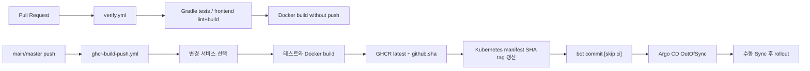
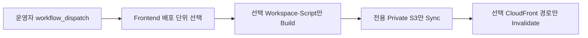
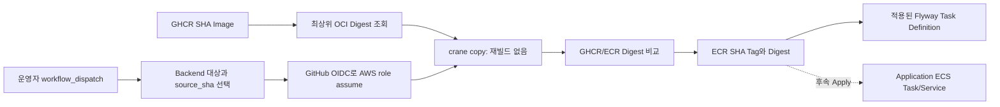
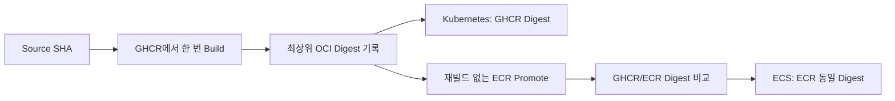

# CI/CD와 배포

## 파이프라인 개요

AWS 정적 Frontend는 Container Image 게시와 별도의 수동 Lane을 사용한다.

## 변경 범위 선택

`infra/ci/select-build-matrix.py`가 Git diff를 다음 원칙으로 매핑한다.

- 서비스 디렉터리 변경: 해당 backend image
- `spring-msa-common-web`: Auth, User, Member BFF, Admin BFF
- `spring-msa-common-kafka`: Member BFF
- member/admin 공통 프런트 파일: 각 workspace의 모든 feature image
- 특정 feature 소스/Dockerfile: 해당 feature image
- 수동 실행: `deploy_target` 하나, Backend 8개만 선택하는 `all-backend`, 또는 전체를 선택하는 `all`

Container Image 매핑은 `infra/ci/test_select_build_matrix.py`, AWS 정적 Frontend 선택은 `infra/ci/test_select_frontend_deploy_matrix.py`로 검증한다.

## 검증 단계

Backend job은 Java 17로 각 서비스의 `./gradlew test`를 실행한다. Wrapper 9.3.0, dependency lock, verification metadata가 저장소에 있으므로 잠기지 않거나 검증되지 않은 artifact는 실패해야 한다.

Frontend job은 Node 24.18.0과 Corepack을 사용해 pnpm 10.0.0을 설치하고 루트에서 `pnpm install --frozen-lockfile`, workspace별 lint와 `build:all`을 실행한다. 이후 모든 선택 이미지에 대해 Docker build를 수행한다.

## AWS Frontend 선택 배포

`.github/workflows/aws-frontend-deploy.yml`은 `master`에서만 수동 실행한다. 배포 대상은 `member`, `community`, `stock`, `admin`, `admin-users`, `admin-logs` 여섯 개이며 `all-member`, `all-admin`, `all` 그룹도 제공한다.

- 각 단위는 자기 Build Script와 산출물 디렉터리를 가진다.
- 각 단위는 전용 Private S3 Bucket 하나만 동기화한다.
- Member CloudFront는 기본 Member, `/community/*`, `/stock/*` 세 Origin을 사용한다.
- Admin CloudFront는 기본 Admin, `/manage/users/*`, `/manage/logs/*` 세 Origin을 사용한다.
- Invalidation은 선택한 Entry·경로로 제한하며 동시 Frontend 배포를 직렬화한다.
- GitHub OIDC Role은 `master` Subject만 신뢰하고 여섯 Bucket 객체 작업과 두 Distribution Invalidation만 허용한다.

따라서 Stock 개발자가 `spring-stock-web`을 선택하면 Community나 Member를 Build·Upload하지 않는다. 자세한 Apply·GitHub Variable·curl 절차는 [AWS Frontend Runbook](../runbooks/aws-frontend-hosting.md)을 따른다. Custom Domain, ACM, Route 53과 API/OAuth/WebSocket ALB Origin은 다음 단계다.

## 이미지 게시

GHCR에는 두 태그가 게시된다.

- `latest`: 사람이 확인하기 위한 이동 태그이며 배포에는 사용하지 않는다.
- `${github.sha}`: Kubernetes 매니페스트가 사용하는 고정 태그다.

`update-k8s-image-tags.py`는 선택한 컨테이너의 image line을 Git SHA 태그로 변경한다. workflow는 `:latest`가 매니페스트에 남아 있으면 실패하고, 변경을 `github-actions[bot]`으로 commit/push한다.

Git SHA 태그는 운영 규칙상 immutable로 취급한다. GHCR에서 tag overwrite를 기술적으로 막는 정책은 이 저장소에 없으므로 같은 SHA 태그를 다른 내용으로 재게시하지 않는 통제가 필요하다. 더 강한 보장이 필요하면 manifest digest 배포로 전환한다.

## Argo CD

Application은 `master` branch의 `infra/k8s/spring-msa`를 감시하고 `spring-msa` namespace를 대상으로 한다. 현재 `syncPolicy`에는 `CreateNamespace=true`만 있고 `automated`가 없다. 따라서 Git 변경을 감지해 OutOfSync가 되지만 실제 적용에는 UI 또는 CLI Sync가 필요하다.

자동 Sync를 도입할 때는 다음을 먼저 결정한다.

- `prune` 허용 여부
- `selfHeal` 허용 여부
- production 승인 gate
- Secret 관리 방식
- 실패 시 자동 rollback 대신 Git revert 원칙

## AWS ECR 전환 경로

최초 ECR 구현은 Kubernetes Delivery와 분리된 수동 재빌드 경로였으며 Backend 8개 게시 검증까지 완료했다. 이후 Workflow를 Build Once·Promote 방식으로 교체해 GitHub `master`에 반영했고, 새 Source SHA의 Database Migration Image 3개와 Application Runtime용 Backend 8개에서 실제 Promote를 검증했다.

- `.github/workflows/ecr-build-push.yml`은 backend 8개 또는 Database Migration 대상 3개를 선택한다.
- ECR에는 `latest`를 발행하지 않고 전체 Git commit SHA만 사용한다.
- 최초 Terraform module, 저장 Plan Apply, GitHub 변수 연결과 Backend 8개 재빌드 게시 검증은 완료했다.
- ECR 전체 게시 기준은 SHA `3564959efa1637e60fe72f009d4fa1a5809de01b`, GitHub Actions run `29561837114`다.
- 새 Workflow는 `source_sha`의 GHCR Image를 `crane copy`하고, 기존 ECR Tag가 같은 Digest면 Skip하며 다르면 실패한다. Source SHA `a7b3e0387c6817fd5a781ccf3ac532e04f38c9e1`의 GHCR Run `29648349144`와 ECR Run `29648492164`에서 Backend 8개 모두의 Digest 일치를 실제 검증했다.
- RDS/Secrets Terraform, DB Secret 초기화, 실제 RDS Role·Schema Bootstrap과 Flyway V1을 완료했다. Digest 고정 ECS Application Service 8개, Cloud Map, ALB와 Valkey도 Runtime ON에서 검증한 뒤 현재 Runtime OFF로 전환했다. AWS 정적 Frontend S3·CloudFront Foundation과 배포 IAM을 Apply하고 GitHub Variable, 첫 전체 배포 6/6과 curl 6/6까지 검증했다.
- 실제 적용 상태와 승인 gate는 [`infra/aws/terraform/README.md`](../../infra/aws/terraform/README.md)를 기준으로 한다.

GHCR→Kubernetes가 현재 delivery 기준이고 ECR→AWS는 migration lane이다. 한쪽 장애가 다른 쪽 image publication을 막지 않도록 workflow와 registry 권한을 독립적으로 유지한다.

### Build Once·Promote 구현

과거 재빌드 방식은 같은 Source SHA를 사용하더라도 Build 시점의 Base Image나 Package Repository 상태 때문에 GHCR과 ECR의 Binary가 달라질 수 있었다. 이 위험을 제거하기 위해 다음 방식으로 전환했다.

- GHCR Workflow가 서비스와 Source SHA당 Backend Image를 한 번만 Build한다.
- 무결성 기준은 Git SHA Tag가 아니라 최상위 OCI Manifest Digest다.
- ECR Workflow는 명시적으로 입력받은 `source_sha`의 GHCR Image를 재빌드하지 않고 복사한다.
- Promote 후 GHCR과 ECR Digest가 같아야 성공한다.
- 기존 ECR SHA Tag가 있으면 Digest가 같을 때만 Skip하고 다르면 실패한다.
- Kubernetes와 ECS는 각 Registry의 동일 Digest를 사용하며 `latest`는 배포 기준으로 사용하지 않는다.

구현·로컬 검증, Database Migration 대상과 Application Runtime Backend 8개의 실제 원격 실행을 완료했다. 후속 서비스 실행 절차는 [AWS Learning Application Runtime Runbook](../runbooks/aws-application-runtime.md)을 따른다.

## DR delivery 참고 원칙

Kubernetes↔AWS DR은 Learning 적용 범위에서 제외했다. 향후 운영형 DR을 다시 검토할 때는 Build Once·Promote로 검증된 동일 OCI Digest뿐 아니라 DB 복제, Write Fencing, DNS/TLS, Secret과 Smoke Test가 모두 준비돼야 한다. 자세한 목표 경계는 [재해 복구 아키텍처](disaster-recovery.md)를 참고하되 현재 실행 가능한 기능으로 간주하지 않는다.

## 버전 고정

- 외부 Docker base/runtime 이미지는 digest로 고정한다.
- 현재 애플리케이션 이미지는 Git SHA Tag로 추적한다. 목표 배포 기준은 Registry별 동일 OCI Digest다.
- Helm chart는 설치 스크립트에서 버전을 명시한다.
- Gradle distribution과 wrapper JAR은 checksum을 검증한다.
- pnpm lockfile은 workspace 루트 하나만 사용한다.

## 롤백

권장 롤백은 정상으로 확인된 이전 Git SHA image tag를 매니페스트에 다시 기록하고 commit한 뒤 Argo CD Sync하는 것이다. Kubernetes `rollout undo`는 긴급 복구에만 사용하고, 사용 후 Git desired state도 반드시 같은 이미지로 맞춘다. 자세한 절차는 [rollback runbook](../runbooks/rollback.md)을 따른다.
