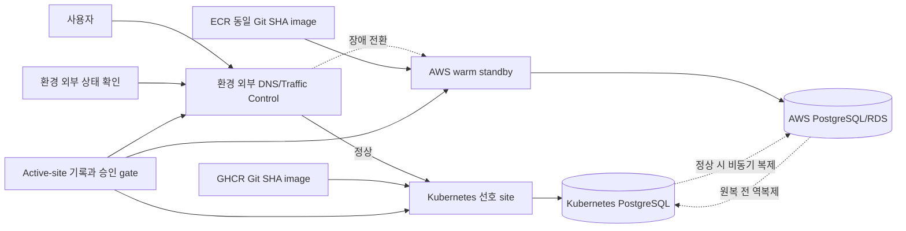

# Kubernetes↔AWS 재해 복구

- 상태: 목표 아키텍처, 미구현
- 기준일: 2026-07-17
- 관련 결정: [ADR-006](../decisions/ADR-006-reversible-k8s-aws-dr.md)
- 실행 계획: [Kubernetes↔AWS DR 계획](../plans/2026-07-17-k8s-aws-dr-plan.md)

## 목적

선호 환경인 Kubernetes가 장시간 사용할 수 없을 때 AWS warm standby로 장애 전환하고, Kubernetes가 안정적으로 복구된 뒤 데이터를 다시 동기화해 원복할 수 있는 경계를 정의한다. 반대로 AWS가 장애일 때도 Kubernetes가 AWS 전용 registry, DNS, secret 또는 data service에 종속되어 함께 중단되지 않도록 한다.

이 문서는 현재 실행 가능한 기능을 설명하지 않는다. 저장소에는 로컬 Kubernetes 배포 경로와 일부 AWS Foundation/ECR 준비만 있고, AWS workload와 교차 환경 data replication은 아직 없다.

## 현재와 목표

| 영역 | 현재 | 목표 |
| --- | --- | --- |
| Kubernetes | `localtest.me`, 단일 PostgreSQL/Kafka, 로컬 storage | 외부 접근 가능한 선호 site |
| AWS | Foundation 적용 기록, ECR/OIDC Apply 대기 | ECS/ALB/RDS 기반 warm standby |
| Image | GHCR Git SHA로 Kubernetes 배포 | 같은 source SHA를 GHCR/ECR 양쪽에 보존 |
| Database | 환경 간 복제 없음 | PostgreSQL 비동기 복제와 명시적 promotion |
| Redis | 환경 간 복제 없음 | cache 재생성, session은 재로그인 허용 |
| Kafka | Kubernetes 단일 broker, Outbox 미구현 | PostgreSQL Outbox 기준 재발행 또는 별도 복제 |
| Traffic | 로컬 ingress만 존재 | site 외부 health check와 DNS/traffic 전환 |
| 운영 | 수동 Argo CD Sync | 승인된 failover/failback runbook과 정기 훈련 |

## 목표 구조

복제 화살표가 양쪽에 있어도 동시에 양방향 write를 허용한다는 뜻은 아니다. 어느 시점이든 하나의 database만 writer이며 다른 쪽은 replica 또는 재구축 대상이다.

## 상태 전이

| 단계 | Active site | Database writer | 비고 |
| --- | --- | --- | --- |
| 정상 | Kubernetes | Kubernetes PostgreSQL | AWS는 warm standby |
| 장애 확인 | 없음 또는 Kubernetes | 기존 writer를 fencing | 변경과 자동 배포 중지 |
| Failover | AWS | AWS PostgreSQL | AWS 검증 후 traffic 전환 |
| 복구·재동기화 | AWS | AWS PostgreSQL | Kubernetes는 write 금지 |
| Failback | Kubernetes | Kubernetes PostgreSQL | 최종 동기화·승격 후 전환 |
| 정상 복귀 | Kubernetes | Kubernetes PostgreSQL | AWS를 새 replica로 재구성 |

## 단일 writer와 fencing

장애 전환의 첫 번째 안전 조건은 이전 site가 더 이상 write할 수 없다는 증거다. 단순 DNS 변경은 이미 연결된 client, 내부 worker와 재시작된 pod를 막지 못한다.

최소 fencing 수단은 다음을 포함한다.

- 이전 site application의 database write credential 폐기 또는 network 차단
- 도달 가능한 경우 gateway/BFF/domain service scale-down
- scheduler, consumer, outbox relay 중지
- active-site generation 또는 lease를 확인하지 못한 instance의 startup 차단
- promotion 전 replication lag와 마지막 적용 위치 기록

두 site의 write 차단 여부를 확인할 수 없다면 자동 promotion하지 않고 운영자 승인을 요구한다.

## 데이터 계층

### PostgreSQL

채팅, 사용자와 관심 종목의 기준 데이터다. 비동기 복제를 기본으로 하고 RPO는 관측된 replication lag로 계산한다. Failover 뒤 Kubernetes를 복구할 때는 AWS writer에서 새 replica를 만들고 catch-up한 다음 짧은 write freeze에서 최종 동기화한다.

물리 복제와 논리 복제 중 하나를 구현 전에 선택해야 한다. PostgreSQL major version, extension, schema migration 순서, sequence와 large object 지원, network 암호화, backup/restore 시간을 함께 검증한다.

### Redis

cache와 lock은 새 site에서 다시 만든다. Spring Session을 교차 환경에 양방향 복제하지 않고 failover 시 기존 session을 무효화해 재로그인을 허용하는 것을 1단계 원칙으로 한다. OAuth redirect URI, cookie domain, CSRF 이름은 public domain이 유지되도록 사전 배치한다.

### Kafka와 Outbox

현재 Kafka broker는 단일 replica이며 DB commit 뒤 직접 발행하므로 DR 기준이 될 수 없다. [ADR-003](../decisions/ADR-003-kafka-outbox-chat.md)의 Outbox를 먼저 구현해 PostgreSQL을 event 재발행의 기준으로 만든다. 초기 DR에서는 cross-site Kafka active-active보다 Outbox backlog 재처리를 우선하고, 별도 Kafka 복제가 필요하면 consumer offset과 topic compatibility를 포함한 후속 결정을 작성한다.

Community Service의 메모리 게시물은 어느 site에서도 복구되지 않는다. DR 완료 조건에 포함하려면 먼저 PostgreSQL 영속화를 구현해야 한다.

## Image와 배포

- Kubernetes는 GHCR의 immutable Git SHA tag를 사용한다.
- AWS는 ECR Apply 이후 같은 source SHA tag를 사용한다.
- Failover 전에 두 registry image의 source revision과 검증 결과가 같아야 한다.
- `latest` 또는 build 시점이 다른 image로 site를 전환하지 않는다.
- AWS 장애가 Kubernetes image pull을 막지 않도록 Kubernetes는 ECR에만 의존하지 않는다.
- GitHub/GHCR 장애까지 포함하려면 각 cluster가 필요한 image를 이미 보유하거나 별도 registry mirror를 둔다.

## DNS, TLS와 인증

`app.hyuncloudlab.com`과 `admin.hyuncloudlab.com` public origin은 site 전환 후에도 유지한다. 두 site에 같은 hostname의 TLS 인증서와 OAuth2 redirect/logout URI를 사전 구성한다. DNS 또는 global traffic control의 health check는 Kubernetes와 AWS 바깥에서 수행해야 한다.

AWS region 장애만 범위라면 global AWS DNS 사용을 검토할 수 있지만, AWS 전체 의존성 장애까지 범위에 포함하면 AWS 외부 control plane이 필요하다. DNS TTL만 낮추는 것으로 기존 connection과 WebSocket이 즉시 이동하지는 않으므로 client reconnect 동작도 검증한다.

## RTO와 RPO 목표

- 목표 RTO: warm standby 기준 5~15분
- 목표 RPO: PostgreSQL replication lag 기준 수초~수분
- Session RPO: 보장하지 않으며 재로그인을 허용
- Kafka 후속 event RPO: Outbox 구현 뒤 database RPO와 일치시키는 것이 목표

이 수치는 설계 목표다. 정기 훈련에서 측정된 값이 목표를 만족하기 전에는 운영 보장으로 표시하지 않는다.

## 관측성과 승인

- site 외부에서 member/admin login, 핵심 read/write와 WebSocket을 확인한다.
- replication lag, last replay position, database role, active-site generation을 기록한다.
- 자동 감지는 가능하지만 promotion은 다중 신호와 승인 gate를 둔다.
- Failback은 자동 실행하지 않는다. 복구 완료, 역복제와 write freeze 검증 후 승인한다.
- failover/failback 동안 CI 배포와 schema migration을 중지한다.

## 현재 차단 요소

1. AWS ECS/ALB/RDS/ElastiCache workload가 없다.
2. 외부 접근 가능한 Kubernetes DR 환경과 production overlay가 없다.
3. PostgreSQL 교차 환경 복제와 promotion/fencing이 없다.
4. DNS/TLS/secret의 양쪽 사전 배치가 없다.
5. Kafka Outbox와 Community 영속화가 없다.
6. site 외부 health check, active-site 기록과 운영 승인 자동화가 없다.

따라서 현재 [Kubernetes→AWS failover](../runbooks/k8s-to-aws-failover.md)와 [AWS→Kubernetes failback](../runbooks/aws-to-k8s-failback.md)은 설계용 체크리스트이며 실제 장애 시 실행하면 안 된다.
