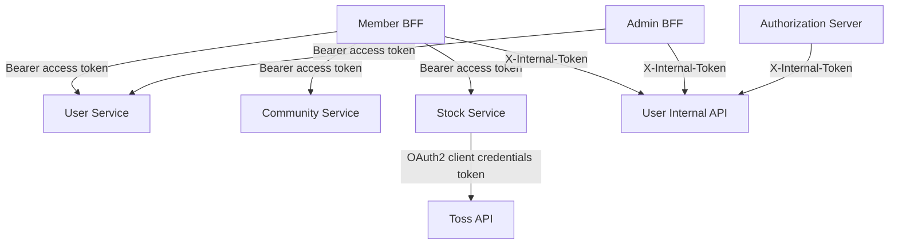

# MSA 구성

## 백엔드 서비스

| 프로젝트 | 포트 | 책임 | 주요 의존성 |
| --- | ---: | --- | --- |
| `spring-member-gateway` | 8080 | 회원 BFF, 도메인 API, 인증 서버 라우팅과 CORS | Spring Cloud Gateway WebFlux |
| `spring-admin-gateway` | 8090 | 관리자 BFF와 인증 서버 라우팅과 CORS | Spring Cloud Gateway WebFlux |
| `spring-security-authorization-server` | 9000 | 비밀번호 로그인, OAuth2 Authorization Code, OIDC, JWT 발급 | Redis Session, User Service |
| `spring-user-service` | 8081 | 사용자·역할·자격 증명 조회와 가입 | PostgreSQL, JWT Resource Server |
| `spring-member-community-service` | 8083 | 게시물 CRUD | JWT Resource Server, 현재 메모리 저장 |
| `spring-member-stock-service` | 8084 | 관심 종목, 시세·종목·캔들 조회 | PostgreSQL, Redis, Toss API |
| `spring-member-bff-service` | 8079 | 회원 세션, API 조합, presence, 채팅 | Redis, PostgreSQL, Kafka, Feign |
| `spring-admin-bff-service` | 8087 | 관리자 세션, 사용자·회원 세션 조회 | Redis, User Service, Feign |
| `spring-msa-common-web` | - | API envelope와 공통 오류 계약 | Jackson 3, Spring Web |
| `spring-msa-common-kafka` | - | Kafka topic과 채팅 이벤트 계약 | Java library |

모든 Gradle 프로젝트는 Java 17 toolchain, Gradle Wrapper 9.3.0, `gradle.lockfile`, `verification-metadata.xml`을 사용한다. 공통 라이브러리는 일부 서비스 Docker 빌드에서 composite build로 함께 포함된다.

## 프런트엔드 구조

`FrontEnd`는 pnpm workspace 하나이며 lockfile도 루트의 `pnpm-lock.yaml` 하나만 사용한다.

| workspace | 화면 | 배포 이미지 |
| --- | --- | --- |
| `apps/member` | 회원 홈·인증·채팅·커뮤니티·주식 | `spring-member-web`, `spring-community-web`, `spring-stock-web` |
| `apps/admin` | 관리자 홈·인증·사용자·로그 | `spring-admin-web`, `spring-admin-users-web`, `spring-admin-logs-web` |

각 feature 이미지는 같은 workspace 소스를 다른 Vite mode와 HTML entry로 빌드한다. 로컬 Compose는 통합 member/admin 이미지만 실행하고, Kubernetes는 경로별 전용 이미지를 Ingress에 연결한다.

## 동기 호출 관계

`/internal/**`는 외부 JWT 대신 `X-Internal-Token` 공유 비밀로 보호된다. 게이트웨이는 이 경로를 외부 라우트로 노출하지 않지만, 네트워크 정책까지 포함한 추가 방어가 권장된다.

## 비동기·공유 상태

| 저장소/브로커 | 사용처 | 키 또는 데이터 |
| --- | --- | --- |
| PostgreSQL | User Service | `users`, `user_roles` |
| PostgreSQL | Stock Service | 관심 종목 |
| PostgreSQL | Member BFF | `chat_rooms`, `chat_messages` |
| Redis | Auth/Member/Admin BFF | 분리된 Spring Session namespace |
| Redis | Member/Admin BFF | presence TTL key와 Redis Stream |
| Redis | Member BFF | 채팅 pub/sub, 최근 메시지 list cache |
| Redis | Stock Service | 시세·종목·캔들 cache, 갱신 lock, Toss token |
| Kafka | Member BFF | `spring.chat.message.created`, `.DLT` |

## 배포 단위

`infra/ci/select-build-matrix.py`가 변경 파일을 서비스/이미지 단위로 매핑한다. 공통 백엔드 모듈 변경은 소비 서비스를 함께 선택하고, 프런트 루트 lockfile 또는 workspace 설정 변경은 6개 프런트 이미지를 모두 선택한다.

Kubernetes 기준 Member BFF만 2 replicas이며 나머지 애플리케이션은 기본 1 replica다. Kafka와 PostgreSQL도 단일 replica이므로 현재 매니페스트는 고가용성 운영 구성이 아니라 로컬 검증 기준이다.
