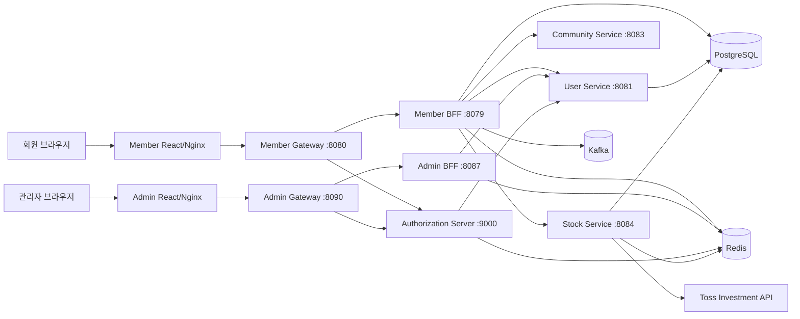

# 시스템 개요

## 목적

Spring React MSA는 회원용과 관리자용 웹 경계를 분리하고, OAuth2/OIDC 인증 서버와 도메인 서비스를 BFF 뒤에 배치한 학습·검증용 MSA다. 회원 경로는 커뮤니티, 주식, 실시간 채팅을 제공하고 관리자 경로는 사용자와 회원 세션·접속 상태 조회를 제공한다.

## 전체 구조

## 외부 경계

| 호스트 | 주요 경로 | 목적 |
| --- | --- | --- |
| `user.localtest.me` | `/`, `/community`, `/stock` | 회원 웹 |
| `user.localtest.me` | `/bff/**`, `/api/**`, OAuth/OIDC 경로 | 회원 API와 인증 |
| `admin.localtest.me` | `/`, `/manage/users`, `/manage/logs` | 관리자 웹 |
| `admin.localtest.me` | `/admin-bff/**`, OAuth/OIDC 경로 | 관리자 API와 인증 |
| `grafana.localtest.me` | `/` | 로컬 관측성 UI |
| `argocd.localtest.me` | `/` | 로컬 GitOps UI |

브라우저는 도메인 서비스에 직접 access token을 전달하지 않는다. 브라우저에는 BFF 세션 쿠키와 CSRF 쿠키만 노출되고, BFF가 서버 측 OAuth2 authorized client에서 access token을 찾아 하위 서비스에 Bearer 토큰으로 전달한다.

## 데이터 소유권

- User Service: 사용자, 역할, 비밀번호 해시
- Member BFF: 채팅 방·메시지, 세션 메타데이터, 접속 상태
- Stock Service: 사용자 관심 종목, 외부 시세 캐시
- Community Service: 현재는 메모리 게시물만 보유
- Authorization Server: 인증 세션과 OAuth2/OIDC 프로토콜 상태
- Redis: Spring Session, presence TTL/stream, 채팅 pub/sub·최근 메시지, 주식 캐시·토큰 lock
- Kafka: 채팅 생성 이벤트와 DLT

현재 로컬/Kubernetes 매니페스트는 하나의 PostgreSQL 인스턴스를 여러 서비스가 사용하도록 구성한다. 논리적 소유권은 분리하지만 물리적 데이터베이스 격리는 아직 강제하지 않는다.

## 주요 품질 속성

- 보안: 브라우저 토큰 비노출, HttpOnly 세션 쿠키, BFF별 CSRF 이름, 관리자 역할 검증
- 확장성: Member BFF 2 replicas, Redis pub/sub 기반 WebSocket fan-out
- 복원력: 주식 stale cache, Kafka consumer retry와 DLT
- 재현성: 잠금된 Gradle/pnpm 의존성, checksum과 이미지 digest, Helm chart 버전
- 관측성: actuator Prometheus endpoint, Kafka JMX/exporter, Loki 로그 수집

## 알려진 경계

- 회원 BFF가 채팅 영속성까지 소유하므로 BFF가 얇은 조합 계층을 넘어 도메인 책임을 가진다.
- Redis pub/sub은 메시지를 보존하지 않는다. 연결 중인 WebSocket fan-out 용도이며 이력은 PostgreSQL이 기준이다.
- Kafka 발행 실패 시 PostgreSQL에 저장된 메시지를 자동 재발행할 영속 Outbox가 없다.
- Argo CD는 현재 자동 Sync가 아닌 수동 Sync 정책이다.

## 배포 환경과 재해 복구 경계

현재 동작이 저장소에서 검증되는 배포 경로는 GHCR 이미지와 로컬 Kubernetes/Argo CD이며 AWS Learning Runtime도 실제 기동 검증을 완료했다. AWS에는 Terraform Foundation·ECR/OIDC·RDS/Secrets·ECS Compute와 Application Foundation이 적용됐고 Database Migration Image 3개의 실제 RDS Flyway V1, Backend 8개의 Build Once·Digest Promote와 Cloud Map custom health를 검증했다. Runtime ON에서 ASG `1/1/2`와 EC2 1대, Digest 고정 ECS Service 8개 `1/1/0`, RDS·단일 Valkey·Public ALB를 실행하고 Container Health·OCI Digest·Cloud Map 등록 8/8, ALB Target 2/2와 HTTP curl Smoke 6/6을 확인했다. 검증 뒤 Runtime OFF를 적용해 현재 ECS Service·Task·ASG·EC2는 0, Public ALB·Valkey는 삭제, RDS는 정지 상태이며 Application Foundation은 유지한다.

AWS 전환 자료는 [`docs/aws-migration`](../aws-migration/00-service-inventory.md)에 두고 현재 서비스 계약과 중복 작성하지 않는다. AWS Learning Runtime의 승인된 목표는 [AWS Learning Runtime 결정](../aws-migration/07-learning-runtime-design.md)을 따른다. Kubernetes를 선호 Site, AWS를 Warm Standby로 사용하는 Active-Passive DR은 Learning 적용 범위에서 제외했으며 [재해 복구 아키텍처](disaster-recovery.md)에 운영 환경 참고 제안으로만 보존한다.
