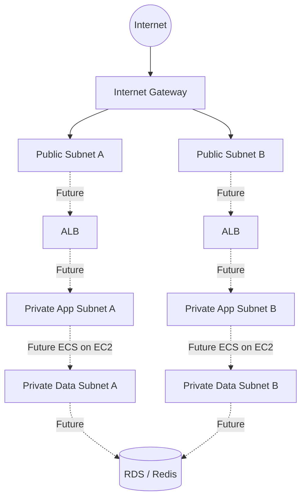

# AWS Foundation 설계

> 문서 상태: Foundation 설계 및 적용 기록
>
> 기준일: 2026-07-18
>
> 저장소 상태: Network/ECR/OIDC/Private App 송신 Terraform 코드 존재
>
> AWS 적용 상태: Foundation·ECR/OIDC·Private App 송신 적용과 Backend 8개 Image 게시 완료, workload 미구현

AWS 적용 상태와 승인 절차의 운영 기준은 [`infra/aws/terraform/README.md`](../../infra/aws/terraform/README.md)다. Git에는 실제 Terraform state가 없으므로 이 설계 문서만으로 계정의 현재 상태를 단정하지 않는다. Foundation 이후 승인한 Runtime 구조는 [AWS Learning Runtime 결정](07-learning-runtime-design.md), 현재 전체 배포 경계는 [CI/CD와 배포](../architecture/cicd-deployment.md)를 따른다. Kubernetes↔AWS DR은 Learning 범위에서 제외하고 후속 학습 과제로 보류했다.

## 1. 요구사항

- 대상 환경은 개인 학습용 `learning` 환경 하나이며 AWS 리전은 `ap-northeast-2`로 고정한다.
- 네트워크는 2개 가용 영역에 걸쳐 구성하되, 이번 단계에서는 컴퓨팅과 데이터 리소스를 생성하지 않는다.
- 비용을 우선 통제하기 위해 NAT Gateway, Elastic IP, ALB, ECS, EC2, RDS, ElastiCache, MSK를 생성하지 않는다.
- Foundation 최초 Apply는 Local State를 사용했으며 이후 S3 Remote Backend와 Native Lockfile로 이전했다. 모든 Apply는 Plan 검토와 사용자 승인 이후에만 수행한다.
- 모든 관리 대상 리소스에는 `Project`, `Environment`, `ManagedBy`, `Purpose` 태그를 적용한다.

## 2. 네트워크 CIDR

| 계층 | AZ 1 | AZ 2 |
|---|---|---|
| VPC | `10.20.0.0/16` | 동일 VPC |
| Public | `10.20.0.0/24` | `10.20.1.0/24` |
| Private App | `10.20.10.0/24` | `10.20.11.0/24` |
| Private Data | `10.20.20.0/24` | `10.20.21.0/24` |

가용 영역 이름은 하드코딩하지 않고 `data.aws_availability_zones`에서 사용 가능한 첫 두 개를 선택한다. VPC DNS 지원과 DNS 호스트 이름을 활성화하고, Public Subnet도 `map_public_ip_on_launch = false`로 유지한다.

## 3. Subnet 구조

점선으로 표시한 ALB, ECS on EC2, RDS, Redis는 이번 단계에서 생성하지 않는다.

## 4. Route Table 구조

- Public Route Table 하나를 Public Subnet 두 개에 연결한다.
  - VPC 로컬 경로
  - `0.0.0.0/0 -> Internet Gateway`
- Private App Route Table 하나를 Private App Subnet 두 개에 연결한다.
  - VPC 로컬 경로
  - `0.0.0.0/0 -> Public Subnet A의 단일 NAT Gateway`
  - S3 Prefix List 경로는 S3 Gateway Endpoint 사용
- Private Data Route Table 하나를 Private Data Subnet 두 개에 연결한다.
  - VPC 로컬 경로만 사용
- Private Data Route Table에는 NAT, Internet Gateway 또는 VPC Endpoint 경로를 만들지 않는다.

## 5. Security Group 구조

### ALB Security Group

- Inbound: TCP `80`, `443`을 `0.0.0.0/0`에서 허용한다.
- Outbound: ECS Application Security Group의 Gateway 포트 `8080`, `8090`만 허용한다.

### ECS Application Security Group

- Inbound from ALB SG: TCP `8080`, `8090`
- Inbound from self: TCP `8079`, `8087`, `9000`, `8081`, `8083`, `8084`
- Outbound to self: 내부 서비스 포트 `8079`, `8087`, `9000`, `8081`, `8083`, `8084`
- Outbound to Data SG: TCP `5432`, `6379`, `9092`
- Outbound to AWS Public API/외부 서비스: TCP `443`

### Data Security Group

- Inbound from ECS SG: TCP `5432`, `6379`, `9092`
- Kafka `9092`는 향후 선택적으로 사용할 규칙이며 첫 AWS 전환에서는 Kafka를 비활성화한다.

Security Group 본체와 규칙을 별도 Terraform 리소스로 작성해 상호 참조로 인한 의존성 순환을 피한다. 외부에서는 애플리케이션, 데이터, Kafka, SSH 포트를 직접 열지 않는다. 이후 EC2 운영 접속은 Systems Manager Session Manager를 사용한다.

## 6. 요청 흐름

1. 인터넷 요청은 미래의 ALB가 배치될 Public Subnet까지 도달한다.
2. ALB는 Member Gateway `8080` 또는 Admin Gateway `8090`으로 전달한다.
3. Gateway는 Private App 계층의 BFF와 내부 서비스 포트로 통신한다.
4. 데이터 접근은 ECS SG에서 Data SG의 PostgreSQL `5432`, Redis `6379`, 선택적 Kafka `9092`로만 허용한다.
5. 현재는 ALB와 ECS가 없으므로 실제 요청 흐름은 활성화되지 않는다.

향후 `app.hyuncloudlab.com`은 Member 흐름, `admin.hyuncloudlab.com`은 Admin 흐름에 연결한다. `origin.hyuncloudlab.com`은 프런트엔드 원본 경계로 검토하되, 이번 단계에서는 Route 53 Record, ACM 인증서, CloudFront를 만들지 않는다.

## 7. 비용 절감 결정

- VPC, Subnet, Route Table, Security Group 자체에는 별도 시간당 요금이 없다.
- Internet Gateway 자체는 무료이며, 실제 데이터 전송이 발생하면 데이터 전송 요금이 별도로 발생할 수 있다.
- NAT Gateway용 고정 EIP 1개에 Public IPv4 시간당 USD 0.005가 발생한다.
- 일반 AWS Budget 모니터링과 알림은 무료이며, Budget Action과 Budget Report는 이번 범위에서 제외한다.
- 후속 Private App 송신 단계에서 서울 리전 시간당 USD 0.059의 단일 Zonal NAT Gateway와 추가 요금이 없는 S3 Gateway Endpoint를 적용했다. EIP를 포함한 730시간 상시 ON 고정비는 약 USD 46.72이고 NAT Data 처리비와 전송비는 별도다.
- Route 53 Hosted Zone과 이미 등록한 도메인 비용은 기존 비용이며 이번 Terraform 범위에 포함하지 않는다.

가격은 변경될 수 있으므로 Apply 직전 [Amazon VPC 요금](https://aws.amazon.com/ko/vpc/pricing/)과 [AWS Budgets 요금](https://aws.amazon.com/aws-cost-management/aws-budgets/pricing/)을 다시 확인한다.

## 8. 가용성 한계

- Subnet은 2개 AZ에 배치하지만 아직 워크로드가 없어 실제 서비스 가용성을 제공하지 않는다.
- Private App Subnet은 NAT를 통해 ECR API, CloudWatch, Secrets Manager와 외부 HTTPS API에 접근하고 S3 Traffic은 Gateway Endpoint를 사용한다.
- Private Data Subnet에는 인터넷 송신 경로가 없으므로 데이터 계층이 직접 외부 API를 호출하는 구조는 허용하지 않는다.
- 단일 NAT Gateway를 선택하면 비용은 줄지만 AZ 장애 시 다른 AZ의 Private App 워크로드도 송신 장애를 겪을 수 있다.

## 9. 보안 고려사항

- AWS Access Key와 Secret Key를 Terraform 코드, 변수 파일, 문서에 저장하지 않는다.
- Provider 인증은 AWS CLI Profile, 환경 변수 또는 이후 GitHub OIDC를 사용한다.
- `terraform.tfvars`, State, Plan 파일은 Git에서 제외한다.
- Public Subnet에서도 자동 Public IPv4 할당을 비활성화한다.
- SG-to-SG 참조로 내부 허용 범위를 제한하고 `0.0.0.0/0`은 ALB의 HTTP/HTTPS 수신에만 사용한다.
- 데이터 계층과 SSH를 인터넷에 노출하지 않는다.

## 10. 장애 가능 지점

- 잘못된 AZ 선택 또는 계정별 AZ 가용성 차이로 Plan이 실패할 수 있다.
- AWS 인증 또는 Budgets 권한이 없으면 전체 Plan 또는 Budget 조회가 실패할 수 있다.
- Budget 알림 이메일이 없으면 알림이 없는 불완전한 Budget이 될 수 있으므로 Apply를 차단한다.
- 단일 NAT가 있는 가용 영역에 장애가 발생하면 두 Private App Subnet의 외부 송신이 함께 영향을 받는다. Learning 환경에서는 비용 절감을 위해 이 위험을 수용한다.
- Main Terraform State는 S3 Remote Backend로 이전했다. S3 또는 전용 State Role에 접근하지 못하면 Terraform 작업이 중단되므로 Versioning, 최소 권한, 암호화 백업과 접근 복구 절차를 유지해야 한다.

## 11. 승인된 다음 단계

상위 구조 결정은 [AWS Learning Runtime 결정](07-learning-runtime-design.md)에 기록했다. 구현은 다음 순서로 진행한다.

1. 완료: Secrets Manager Container와 RDS PostgreSQL 16 Terraform을 AWS에 적용하고 실제 RDS Role·Schema Bootstrap까지 검증했다. Flyway Migration Task는 후속 단계다.
2. 완료: ECS on EC2 Cluster와 ASG Capacity Provider를 적용하고 ON/OFF를 검증했다. Application Task Definition과 Service는 후속 단계다.
3. ALB, Frontend S3/CloudFront, ACM과 Route 53 Record를 구현한다.
4. Learning ON/OFF, CloudWatch Logs/Metrics/Alarms와 Backup Restore 절차를 검증한다.
5. Build Once·Digest Promote Workflow를 구현해 현재 ECR 재빌드 방식을 교체한다.

Kubernetes↔AWS DR은 Learning 적용 범위에서 제외하며 기존 문서는 운영 환경 참고 자료로만 유지한다.

## 12. Terraform 리소스 목록

| Terraform 유형 | 개수 | 비고 |
|---|---:|---|
| `aws_vpc` | 1 | `10.20.0.0/16` |
| `aws_subnet` | 6 | Public/App/Data 각 2개 |
| `aws_internet_gateway` | 1 | VPC 연결 |
| `aws_route_table` | 3 | Public/App/Data |
| `aws_route` | 2 | Public IGW, Private App NAT 기본 경로 |
| `aws_route_table_association` | 6 | Subnet별 연결 |
| `aws_security_group` | 3 | ALB/ECS/Data |
| `aws_vpc_security_group_ingress_rule` | 13 | Public, Gateway, 내부, 데이터 |
| `aws_vpc_security_group_egress_rule` | 12 | ALB, 내부, 데이터, 외부 HTTPS 송신 |
| `aws_eip` | 1 | NAT OFF에도 유지하는 고정 Public IPv4 |
| `aws_nat_gateway` | 1 | Public Subnet A의 단일 Zonal NAT |
| `aws_vpc_endpoint` | 1 | Private App Route Table의 S3 Gateway Endpoint |
| `aws_budgets_budget` | 0 또는 1 | 알림 이메일 입력 시 생성 |

## 13. Foundation 최초 Apply 체크리스트 기록

- [ ] AWS CLI Profile과 호출 주체를 확인하고 계정 ID는 보고서에서 마스킹했다.
- [ ] `budget_alert_email`에 실제 수신 주소를 안전하게 입력했다.
- [ ] `terraform fmt -check -recursive`, `terraform validate`, `terraform test`, `terraform plan`이 모두 통과했다.
- [ ] Plan에 NAT Gateway, EIP, ECS, EC2, ALB, RDS, ElastiCache가 없다.
- [ ] Plan의 Add/Change/Destroy와 월 예상 비용을 검토했다.
- [ ] Local State의 백업 및 삭제 책임을 이해했다.
- [ ] 사용자가 `terraform apply` 실행을 명시적으로 승인했다.
