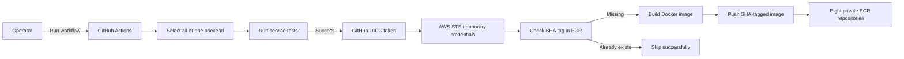

# ECR and GitHub OIDC Design

> 문서 상태: 승인된 repository 설계
>
> 기준일: 2026-07-17
>
> 저장소 상태: Terraform module/test와 수동 workflow 구현 완료
>
> AWS 적용 상태: Plan Apply, GitHub 변수 등록, 단일·중복 Skip·Backend 8개 Image 게시 완료
>
> 게시 기록: PR #3 Merge, ECR 전체 게시 run `29561837114`, SHA `3564959efa1637e60fe72f009d4fa1a5809de01b`

> 후속 결정: 이 문서는 최초 ECR/OIDC 구현 기록이다. 작업 트리의 현재 Workflow는 GHCR Build Once·OCI Digest Promote 방식으로 교체했고 로컬 검증을 통과했다. GitHub `master` 반영과 실제 Promote 실행은 [Build Once·Promote Runbook](../runbooks/aws-image-build-once-promote.md)을 따른다.

현재 운영 절차와 Apply gate는 [`infra/aws/terraform/README.md`](../../infra/aws/terraform/README.md)가 기준이다. 현재 GHCR/Kubernetes 경로와 AWS ECR 경로의 관계는 [CI/CD와 배포](../architecture/cicd-deployment.md), immutable image 원칙은 [ADR-004](../decisions/ADR-004-ghcr-immutable-image-tag.md)를 따른다.

## 1. Objective

Build the container registry and CI authentication foundation for the AWS learning environment without changing the existing GHCR and Kubernetes delivery path.

Repository implementation, reviewed Terraform Apply, GitHub repository variable connection과 Backend 8개 수동 게시 검증을 완료했다. Image publishing remains manual during the migration phase. This phase does not deploy workloads to ECS.

## 2. Confirmed Requirements

- AWS Region: `ap-northeast-2`
- Environment: `learning`
- GitHub repository: `hyunmyungchoi/Spring-React-MSA`
- Trusted Git branch: `master`
- Publish trigger: manual `workflow_dispatch` only
- Publish target: all backend services or one selected backend service
- Image tag: full Git commit SHA only
- Tagged image retention: five images per repository
- Untagged image retention: one day
- Existing GHCR and Kubernetes workflow: unchanged
- Terraform Apply: requires a separate review and explicit approval

## 3. Scope

### In scope

- Eight private ECR repositories
- Repository encryption, tag immutability, basic scan-on-push, and lifecycle policies
- A GitHub Actions IAM role and least-privilege ECR push policy
- Reuse of the account's existing GitHub OIDC provider
- A separate manual ECR build-and-push workflow
- Terraform and CI validation
- Terraform outputs required to configure the GitHub repository variable

### Out of scope

- NAT Gateway, NAT instance, Elastic IP, or VPC endpoints
- ECS cluster, EC2 Auto Scaling Group, capacity provider, task definitions, or services
- ALB, ACM, Route 53 records, RDS, ElastiCache, MSK, S3 frontend hosting, or CloudFront
- Frontend ECR repositories
- Automatic deployment after image publication
- Replacement or refactoring of the existing GHCR workflow

## 4. Backend Image Inventory

The following repositories are created:

1. `spring-member-gateway`
2. `spring-admin-gateway`
3. `spring-security-authorization-server`
4. `spring-user-service`
5. `spring-member-community-service`
6. `spring-member-stock-service`
7. `spring-member-bff-service`
8. `spring-admin-bff-service`

Each ECR repository name uses this format:

```text
spring-react-msa-learning/<service-name>
```

## 5. Architecture



The existing GHCR workflow remains independent. A failure in the new AWS workflow cannot block the current GHCR publication or Kubernetes manifest update path.

## 6. Terraform Components

### 6.1 ECR module

Create `modules/ecr` with one `for_each`-managed repository and lifecycle policy per backend service.

Repository controls:

- `image_tag_mutability = "IMMUTABLE"`
- AES-256 server-side encryption
- Basic image scan on push
- `force_delete = false` so repositories containing images cannot be destroyed accidentally
- Common `Project`, `Environment`, `ManagedBy`, and `Purpose` tags

Lifecycle rules:

1. Expire untagged images older than one day.
2. Retain only the five newest tagged images.

The module outputs maps of service names to repository names, ARNs, and URLs.

### 6.2 GitHub Actions ECR module

Create `modules/github-actions-ecr` for the GitHub trust and ECR publication permissions.

The existing provider at `https://token.actions.githubusercontent.com` is read through a Terraform data source. Terraform must not attempt to create a duplicate provider or take ownership of the provider already used by another repository.

The role trust policy requires both conditions:

```text
token.actions.githubusercontent.com:aud = sts.amazonaws.com
token.actions.githubusercontent.com:sub = repo:hyunmyungchoi/Spring-React-MSA:ref:refs/heads/master
```

The role permission policy grants `ecr:GetAuthorizationToken` on `*`, because that API does not support repository-level resource scoping. All remaining permissions are limited to the eight ECR repository ARNs:

- `ecr:BatchCheckLayerAvailability`
- `ecr:BatchGetImage`
- `ecr:CompleteLayerUpload`
- `ecr:DescribeImages`
- `ecr:GetDownloadUrlForLayer`
- `ecr:InitiateLayerUpload`
- `ecr:PutImage`
- `ecr:UploadLayerPart`

The root configuration outputs the IAM role ARN as `github_actions_ecr_role_arn`.

## 7. GitHub Actions Workflow

Create `.github/workflows/ecr-build-push.yml` as a separate workflow.

### 7.1 Trigger and inputs

- Trigger only on `workflow_dispatch`.
- Provide a choice input named `deploy_target`.
- The default choice is `all`.
- The remaining choices are the eight backend service names.
- Require the selected ref to be `refs/heads/master` before requesting AWS credentials.

GitHub requires a manually triggered workflow to exist on the default branch before it can be run from the Actions UI. The workflow becomes operational after it is merged to `master`.

### 7.2 Permissions

Use job-level permissions:

```yaml
permissions:
  contents: read
  id-token: write
```

No AWS access key or secret key is stored in GitHub.

### 7.3 Jobs

1. Reuse `infra/ci/select-build-matrix.py` to produce the backend matrix. The workflow ignores the frontend matrix.
2. Run the selected service's Gradle tests.
3. Refuse AWS authentication when the ref is not `master` or the repository variable is missing.
4. Assume the AWS role using OIDC and `vars.AWS_ECR_PUSH_ROLE_ARN`.
5. Log in to the ECR registry.
6. Query ECR for the full `github.sha` tag.
7. Skip successfully if the tag already exists.
8. Build and push only when the tag is absent.

The deterministic repository path is:

```text
spring-react-msa-learning/${service}
```

The workflow publishes no `latest` tag.

## 8. Failure Handling

- A non-`master` run fails before AWS authentication with an explicit branch message.
- A missing `AWS_ECR_PUSH_ROLE_ARN` variable fails before AWS authentication with a configuration message.
- A failed Gradle test prevents AWS authentication and image publication.
- An existing SHA tag is treated as an idempotent success.
- If a matrix run publishes only some services, a rerun skips completed SHA tags and retries the missing services.
- ECR tag immutability prevents an existing SHA tag from being overwritten.
- `force_delete = false` prevents Terraform from deleting non-empty repositories during an accidental destroy or rename.
- No ECS service consumes these images in this phase, so a publication error cannot affect a running AWS workload.

## 9. Testing and Verification

Implementation follows a test-first sequence for Terraform behavior.

Terraform tests must verify:

- Exactly eight repositories are planned.
- Repository names match the confirmed naming convention.
- Tags are immutable.
- AES-256 encryption and scan-on-push are enabled.
- `force_delete` is disabled.
- Lifecycle policies retain five tagged images and expire untagged images after one day.
- The trust policy accepts only the repository's `master` branch and the STS audience.
- ECR upload actions are scoped to the eight repository ARNs.
- Only `ecr:GetAuthorizationToken` uses `Resource = "*"`.

Validation commands:

```powershell
terraform fmt -check -recursive
terraform validate
terraform test
python -m unittest infra/ci/test_select_build_matrix.py
```

The workflow YAML is checked with a GitHub Actions-aware linter before completion.

The authenticated Terraform plan must show:

- 8 ECR repositories
- 8 ECR lifecycle policies
- 1 IAM role
- 1 IAM role policy
- 18 additions in total for this phase
- No changes or destroys to the applied Foundation resources
- No NAT Gateway, Elastic IP, ECS, EC2, ALB, RDS, ElastiCache, or MSK resources

## 10. Rollout

1. Implement and validate the Terraform and workflow changes locally.
2. Produce an authenticated `terraform plan`.
3. Review resource counts, IAM scope, and cost impact.
4. Request explicit approval before `terraform apply`.
5. Apply the 18 planned resources.
6. Set the GitHub repository variable `AWS_ECR_PUSH_ROLE_ARN` to the Terraform output.
7. Merge the workflow to `master`.
8. Manually publish one backend service first.
9. Confirm the SHA tag, image digest, scan result, and lifecycle policy in ECR.
10. Manually publish all eight backend services after the single-service smoke test succeeds.

## 11. Rollback

- Before Apply, rollback is a normal Git revert because no AWS resources exist.
- After Apply but before image publication, Terraform can remove the empty repositories and IAM resources after a reviewed destroy plan.
- After image publication, repositories are protected by `force_delete = false`; images must be explicitly reviewed and removed before repository deletion.
- Removing or disabling the GitHub workflow immediately stops new publications.
- Detaching or deleting the dedicated IAM role stops GitHub access without affecting the existing GHCR workflow.

## 12. Security, Cost, and Operations

- OIDC provides short-lived AWS credentials and removes long-lived GitHub AWS secrets.
- Trust is restricted to one repository and one branch.
- ECR permissions follow least privilege and do not grant ECS, EC2, IAM administration, or repository deletion.
- ECR has no NAT Gateway-style hourly resource charge; primary costs begin with stored image data, vulnerability scanning mode, and data transfer.
- Keeping five SHA-tagged images limits storage growth while retaining a small rollback window.
- Basic scanning is used in this learning phase to avoid enabling account-wide enhanced scanning costs.
- CloudTrail records IAM role assumption and ECR API activity for recent operational investigation.

## 13. Success Criteria

This phase is complete when:

- Terraform validation and tests pass.
- The authenticated plan contains exactly the expected additions and no changes or destroys.
- Apply is separately approved and succeeds.
- The GitHub role ARN is registered as a repository variable.
- A manual single-service run publishes one immutable SHA-tagged image.
- A repeated run skips the existing SHA successfully.
- A manual `all` run publishes the remaining backend images.
- The existing GHCR and Kubernetes workflow remains unchanged and operational.
