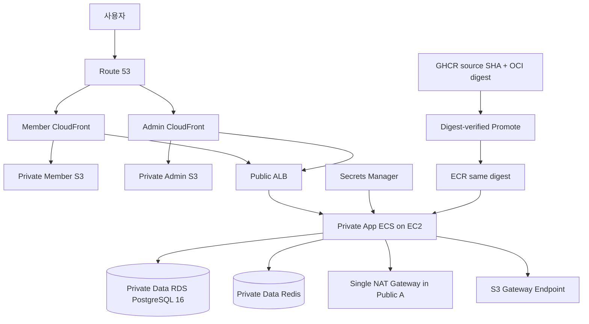

# AWS Learning Runtime 결정

> 문서 상태: Learning 목표 설계 승인, Data Layer·ECS Compute·DB Migration 적용·검증 완료
>
> 기준일: 2026-07-18
>
> 저장소 상태: Foundation·ECR/OIDC·Private App 송신·RDS/Secrets·ECS Compute·DB Bootstrap/Flyway Task 적용, Application Task/Service·Cloud Map·ALB·Valkey 코드 구현 및 로컬 검증 완료
>
> AWS 적용 상태: Foundation·ECR/OIDC·S3 Remote Backend·Private App 송신·RDS/Secrets·ECS Compute 적용, Build Once·ECR Promote와 실제 RDS Flyway V1 검증 완료, RDS 정지·ECS ASG `0/0/0`

이 문서는 AWS Foundation 이후 Learning 환경에 추가할 Runtime의 승인된 결정을 기록한다. 현재 적용된 리소스와 운영 절차는 [Terraform 운영 Runbook](../../infra/aws/terraform/README.md), 이미 적용된 네트워크 기준선은 [AWS Foundation 설계](04-aws-foundation-design.md)를 따른다.

이 문서에서 `승인`은 설계 선택이 끝났다는 뜻이다. Terraform 코드가 존재하거나 AWS에 Apply됐다는 뜻이 아니다.

## 1. 결정 현황

| 우선순위 | 항목 | 승인한 결정 | 구현 상태 |
|---|---|---|---|
| P0 | Private Subnet 송신 | 단일 Zonal NAT Gateway와 S3 Gateway Endpoint | 적용·검증 완료 |
| P0 | Terraform State | S3 Remote Backend와 S3 Native Lockfile | 적용·이전·검증 완료 |
| P0 | Learning 보안 경계 | 관리자 공개 가입 차단, 4자 비밀번호 위험 수용, 원본 Session ID 미노출 | 코드 구현·로컬 테스트 완료, AWS 배포 전 |
| P0 | 이미지 무결성 | GHCR Build Once, OCI Digest 기준 ECR Promote | Backend 8개 Build Once·Promote·8/8 Digest 검증 완료 |
| P1 | ECS 구조 | ECS on EC2, ASG Capacity Provider, Learning ON/OFF | Compute 적용·AWS 검증 완료, ASG `0/0/0`; Task/Service 코드 구현·로컬 검증 완료 |
| P1 | 데이터베이스 | PostgreSQL 16 공유 인스턴스·서비스별 Schema·Flyway | DB Secret·Bootstrap·Flyway V1 3개 실제 실행과 사후 검증 완료 |
| P1 | Frontend | Private S3와 CloudFront | 미구현 |
| P1 | Secret | Secrets Manager로 통일 | Container 7개·DB Task 최소 권한 IAM 적용, DB Secret 3개 초기화 완료 |
| P1 | 도메인 | 기존 Hosted Zone Import와 별도 Global DNS State | 미구현 |
| P2 | DR | Learning 범위에서 제외하고 후속 학습 과제로 보류 | 보류 |

## 2. 목표 구조



Learning 환경만 실제 AWS에 적용한다. 다중 NAT, Interface Endpoint, Multi-Region과 Kubernetes↔AWS DR은 운영 환경 비교 자료로만 다루며 이번 Apply 범위에 넣지 않는다.

## 3. Terraform State

Local State에서 다음 구조로 이전했다.

- S3 Remote Backend
- S3 Versioning 활성화
- 서버 측 암호화 활성화
- Block Public Access 전체 활성화
- HTTPS 요청만 허용하는 Bucket Policy
- Backend 전용 최소 권한 IAM 적용
- `use_lockfile = true`인 S3 Native Lockfile 사용
- DynamoDB Lock Table은 만들지 않음

Backend Bucket과 권한은 해당 Backend가 자기 자신을 관리할 수 없으므로 별도 Bootstrap 단계에서 먼저 생성한다. 기존 Local State는 `terraform init -migrate-state`로 이전하고, 이전 전후 `terraform state list`와 Plan의 무변경 여부를 확인한다.

Learning 구현값은 다음으로 확정한다.

- Bootstrap 위치: `infra/aws/bootstrap/terraform-state`
- Bucket 이름: `spring-react-msa-learning-tfstate-{account-id}-ap-northeast-2`
- 암호화: 별도 KMS Key 없이 SSE-S3 `AES256`
- Main State Key: `learning/runtime/terraform.tfstate`
- Lock Key: `learning/runtime/terraform.tfstate.tflock`
- 접근: `hyun-terraform-admin`만 Assume할 수 있는 전용 최소 권한 State Role
- Bootstrap 자체 State: Git에서 제외한 Local State와 암호화된 개인 백업

Bootstrap Terraform의 저장 Plan을 적용해 S3 Bucket과 전용 IAM 권한을 생성한 뒤 Main State 66개 주소를 S3로 이전했다. 이전 전후 리소스 주소와 State 관리 데이터를 비교했으며, Versioning, SSE-S3 `AES256`, Public Access 차단, HTTPS-only Policy, Native Lockfile 생성·해제와 Terraform 재계획 `No changes`를 검증했다. 새 Backend는 새 Lineage와 Serial 1로 시작하며, 이전 전 Local State는 Git 외부의 Windows EFS 암호화 백업으로 보존한다.

State Key는 최소한 다음 수명주기로 분리한다.

```text
global/dns/terraform.tfstate
learning/runtime/terraform.tfstate
```

State에는 리소스 식별자와 민감한 속성이 기록될 수 있다. 실제 비밀번호와 Token은 `.tf`, `.tfvars`, Terraform Output 또는 Secret Version 리소스에 넣지 않는다.

## 4. Private Subnet 송신

- Public Subnet A에 고정 Elastic IP를 사용하는 NAT Gateway 1개를 배치한다.
- 두 Private App Subnet의 기본 경로 `0.0.0.0/0`는 같은 NAT Gateway를 사용한다.
- ECR API/Registry, ECS, CloudWatch Logs, Secrets Manager와 외부 Toss API 통신은 NAT Gateway를 사용한다.
- Private App Route Table에 S3 Gateway Endpoint를 연결한다.
- ECR Image Layer를 포함한 S3 Traffic은 S3 Gateway Endpoint를 사용한다.
- Private Data Route Table에는 Internet 기본 경로를 만들지 않는다.
- Interface Endpoint와 AZ별 NAT Gateway는 Learning 환경에 적용하지 않는다.
- ECS Security Group은 AWS 공개 API와 외부 서비스에 필요한 TCP 443 송신만 `0.0.0.0/0`으로 허용한다.

단일 NAT가 있는 가용 영역에 장애가 발생하면 두 Private App Subnet의 외부 송신이 모두 영향을 받을 수 있다. Learning 환경에서는 월 고정비와 구성 복잡도를 줄이기 위해 이 위험을 명시적으로 수용한다. NAT Gateway를 OFF 하더라도 고정 EIP는 다음 ON에서 재사용할 수 있도록 유지한다.

현재 구현은 `enable_nat_gateway`로 NAT Gateway와 Private App 기본 경로만 ON/OFF하고, 고정 EIP와 추가 요금이 없는 S3 Gateway Endpoint는 유지한다. 서울 리전 기준 NAT Gateway는 시간당 USD 0.059와 처리량 GB당 USD 0.059, Public IPv4는 시간당 USD 0.005다. 730시간 계속 ON이면 Data 처리비와 전송비를 제외한 고정비만 약 USD 46.72이며, NAT를 OFF해도 EIP 유지 비용 약 USD 3.65/월은 남는다. 현재 USD 50 Budget에서는 상시 ON보다 필요한 학습 시간에만 켜는 방식을 사용한다. 가격과 Gateway Endpoint 과금 기준은 [Amazon VPC 가격](https://aws.amazon.com/vpc/pricing/)과 [S3 Gateway Endpoint 문서](https://docs.aws.amazon.com/vpc/latest/privatelink/vpc-endpoints-s3.html)를 따른다.

검토한 저장 Plan으로 EIP, NAT Gateway, Private App 기본 경로, S3 Gateway Endpoint와 ECS HTTPS 송신 규칙의 5개를 적용했다. NAT `available`, App 기본 경로 `active`, S3 Endpoint `available`, Private Data 외부 경로 0개와 Terraform 재계획 `No changes`를 검증했다.

## 5. ECS on EC2와 ON/OFF

### 초기 Capacity

- ECS 최적화 Amazon Linux 2023 AMI와 두 App AZ 모두에서 제공되는 `m6i.xlarge` On-Demand Instance를 사용한다.
- Auto Scaling Group은 Capacity Provider와 연결한다.
- Runtime ON: ASG `min=1`, `desired=1`, `max=2`
- Runtime OFF: ASG `min=0`, `desired=0`, `max=0`
- Capacity Provider Managed Scaling은 Rolling Deployment 중 Pending Task를 수용할 수 있도록 두 번째 Instance까지 확장한다.
- Learning에서는 ECS Service Application Auto Scaling을 사용하지 않는다.

Backend 8개는 각각 독립된 Task Definition과 ECS Service를 가진다. Runtime ON에서는 Service별 `desired_count=1`, OFF에서는 `0`을 사용한다. 서비스별 CPU/Memory 시작값은 [ECS Resource Baseline](01-resource-baseline.md)을 따른다.

현재 Terraform은 `enable_ecs_compute_foundation`, `enable_application_runtime_foundation`, `learning_runtime_enabled`를 분리한다. Compute Foundation은 적용됐고 Application Foundation 코드는 Task Definition/Service/Cloud Map/Target Group/IAM/Log Group을 유지하는 구조로 구현했다. `learning_runtime_enabled=false`에서는 8개 Service가 `desired_count=0`이고 유료 ALB와 Valkey가 없으며, `true`에서만 ASG `1/1/2`, Service별 Task 1개, Public ALB와 단일 Valkey를 만든다. Application Image 8개 Promote는 완료했지만 저장 Plan 승인 전이므로 이 부분은 실제 AWS에 적용하지 않았다.

Container Instance는 두 Private App Subnet을 사용하고 Public IP와 SSH Ingress를 갖지 않는다. ECS 최적화 Amazon Linux 2023 AMI, `m6i.xlarge`, 암호화한 30 GiB `gp3`, IMDSv2 필수와 SSM Session Manager 접근을 사용한다. Container Insights는 Learning 비용을 줄이기 위해 Compute 단계에서 비활성화하고, Task Log와 최소 Alarm은 Service/관측성 단계에서 별도 확정한다.

ECS Capacity Provider가 ASG에 자동으로 추가하는 필수 `AmazonECSManaged` Tag도 Terraform에서 명시적으로 관리한다. 이를 누락하면 Apply 후 재계획에서 Terraform이 AWS 서비스 Tag를 제거하려는 드리프트가 발생하므로 계약 테스트로 고정한다.

정상 상태 Instance가 1개이므로 두 AZ에 Subnet을 만들었더라도 ECS Compute는 Multi-AZ 고가용성이 아니다. Instance 또는 해당 AZ 장애 시 ASG가 대체 Instance를 시작하는 동안 8개 Backend가 함께 중단될 수 있으며 Learning 환경에서는 이 위험을 수용한다.

Application Task는 `awsvpc`를 사용하고 Cloud Map Private DNS Namespace `learning.spring-react-msa.internal`에 서비스별 A Record를 등록한다. 기존 코드가 사용하는 `http://서비스:고정포트` 형태를 그대로 유지하고 Service Connect Sidecar는 사용하지 않는다. 한 `m6i.xlarge`에 Task ENI 8개를 배치할 수 있도록 Account `awsvpcTrunking=enabled`도 Terraform 관리 대상에 추가했다. 적용 전 실제 계정값은 `disabled`였으며 ASG가 0대인 상태에서 먼저 바꿔 다음 ON Instance부터 적용한다.

Redis 호환 Runtime은 ElastiCache Redis OSS가 아니라 Valkey `7.2`, `cache.t4g.micro`, 단일 Node, Replica·Multi-AZ·Snapshot 없음으로 확정한다. Private Data Subnet과 Data Security Group만 사용하고 저장·전송 암호화와 RBAC를 강제한다. 기본 사용자는 비활성화하고 Application Password는 Terraform Ephemeral Variable과 Provider의 `passwords_wo`에만 전달해 Plan과 State에 저장하지 않는다. Endpoint는 Runtime ON 동안에만 SSM Parameter Store `String`으로 게시하고 Password는 기존 Secrets Manager JSON Key를 사용한다.

Valkey는 정지 기능이 없으므로 Runtime OFF에서 삭제하고 다음 ON에 재생성한다. 세션과 Cache는 Learning 환경에서 폐기 가능한 데이터로 취급하며 RDS처럼 보존하지 않는다. 서울 리전 현재 On-Demand 가격은 `cache.t4g.micro` Valkey Node당 USD 0.0192/시간, 730시간 기준 약 USD 14.02이며 실제 사용 시간만 과금된다.

`learning_runtime_enabled`는 ECS ASG/Service, ALB와 Valkey 같은 실행 비용 리소스의 목표 상태를 제어한다. NAT는 `enable_nat_gateway`로 별도 관리하며 RDS 정지는 Terraform 리소스 삭제와 다르므로 별도 운영 명령 또는 자동화로 수행한다.

RDS Instance는 최대 7일 연속으로만 정지할 수 있고 이후 AWS가 자동으로 다시 시작한다. OFF 운영 자동화는 `AutomaticRestartTime`을 감시해 필요하면 다시 정지하고 Budget Alarm으로 예기치 않은 실행 비용을 확인해야 한다. 정지 중에도 Storage와 Backup Storage 비용은 남는다. 자세한 제한은 [AWS RDS 임시 정지 문서](https://docs.aws.amazon.com/AmazonRDS/latest/UserGuide/USER_StopInstance.html)를 따른다.

### OFF 상태에 유지하는 리소스

- VPC, Subnet, Route Table, Security Group
- NAT용 Elastic IP
- ECR Repository와 Image
- S3 Backend와 Lockfile
- RDS Instance와 Backup; Instance 실행 상태만 정지
- Secrets Manager Secret
- Application Task Definition, ECS Service `desired_count=0`, Cloud Map Namespace/Service, Target Group과 7일 Log Group
- Route 53 Hosted Zone과 ACM DNS 검증 Record
- Frontend S3, CloudFront, `app`과 `admin` Record

OFF 상태에서는 ALB Origin과 Backend API가 제공되지 않는다. Frontend가 유지되더라도 API 기능이 비활성임을 화면에서 분명히 표시해야 한다.

## 6. 데이터베이스와 Migration

- PostgreSQL 16 RDS Instance 1개를 사용한다.
- Database 이름은 `spring_msa`다.
- 비용은 Instance를 공유해 줄이고, 소유권은 Schema와 DB 사용자로 분리한다.
- 구현값은 PostgreSQL `16.14`, `db.t4g.micro`, Single-AZ, 암호화된 고정 20 GiB `gp3`다.
- Performance Insights와 Enhanced Monitoring은 Learning 비용 절감을 위해 끄고, Automated Backup은 7일 유지한다.
- Public 접근은 차단하고 Private Data Subnet 2개와 기존 Data Security Group만 사용한다.

| Service | Schema | DB 사용자 원칙 |
|---|---|---|
| User Service | `user_service` | 자기 Schema만 접근 |
| Member BFF | `member_bff` | 자기 Schema만 접근 |
| Stock Service | `stock_service` | 자기 Schema만 접근 |
| Community Service | 현재 생성하지 않음 | 영속화 구현 후 별도 결정 |

다른 서비스의 테이블을 직접 조회하지 않는다. RDS Master 계정은 Bootstrap과 관리 작업에만 사용하며 Application Task에는 제공하지 않는다.

Schema 변경은 Liquibase가 아니라 서비스별 Flyway SQL Migration으로 관리한다. 각 서비스는 독립된 Migration 경로와 `flyway_schema_history`를 가지며 AWS에서는 다음 설정을 사용한다.

```properties
spring.jpa.hibernate.ddl-auto=validate
spring.sql.init.mode=never
```

테스트 계정과 Seed Data는 AWS Learning Migration에 포함하지 않는다. Flyway는 Private App Subnet에서 실행하는 일회성 ECS Migration Task로 수행하고 성공 후 Application Service를 배포한다.

세 서비스의 Flyway V1 SQL, PostgreSQL 16 Testcontainers 검증과 전용 `FlywayMigrationMain`을 구현했다. 서비스별 DB 사용자·Schema·Grant를 만드는 Bootstrap Task Definition과 최소 권한 IAM/Log Group을 AWS에 적용하고, Secret 3개 초기화와 실제 RDS Bootstrap을 완료했다. RDS 호환 Revision 2와 읽기 전용 검증 Task로 안전한 Role 3개, Schema 3개, 자기 Schema 권한 조합 3개, 교차 Schema 권한 0개를 확인했다. 이후 Build Once·Digest Promote한 ECR Image를 사용하는 Migration Task Definition 3개를 적용하고 실제 Flyway V1을 순차 실행했다. 사후 검증에서 History 3개, V1 성공 3개, Application Table과 올바른 소유자 각 5개, 실패 Migration·교차 권한·Seed Data 0개를 확인했다.

검토한 저장 Plan으로 RDS, DB Subnet Group, Parameter Group과 빈 Secret Container 7개를 AWS에 적용했다. RDS 보안·Backup 설정, Managed Master Secret과 재계획 `No changes`를 검증한 뒤 비용 통제를 위해 RDS를 정지했다. 첫 Backup 완료와 최신 복원 가능 시각은 확인했지만 실제 PITR Restore 훈련은 아직 남아 있다.

RDS는 Runtime OFF 때 삭제하지 않고 정지한다. Automated Backup 보존 기간은 7일, PITR은 활성화하고 의도적인 최종 삭제 전 Final Snapshot을 생성한다. 실제 복구 시간은 Restore 훈련 전까지 보장값으로 표시하지 않는다.

## 7. Frontend

- Member와 Admin에 Private S3 Bucket을 각각 1개 사용한다.
- CloudFront Distribution도 Member와 Admin에 각각 1개 사용한다.
- S3 Website Endpoint와 Public Bucket은 사용하지 않고 Origin Access Control로 CloudFront만 S3에 접근시킨다.
- `app.hyuncloudlab.com`은 Member Distribution, `admin.hyuncloudlab.com`은 Admin Distribution을 가리킨다.
- 정적 SPA Route는 403/404 응답을 `index.html`로 변환한다.
- API, OAuth2, Logout과 WebSocket 경로는 Public ALB Origin으로 전달한다.
- 기존 Frontend Nginx Image는 Docker/Kubernetes 경로에만 남기고 AWS용 ECR/ECS에는 배치하지 않는다.

CloudFront용 ACM 인증서는 `us-east-1`, ALB용 인증서는 `ap-northeast-2`에서 관리한다. Learning Runtime의 ALB Origin은 Public Subnet에 두되 Security Group과 Origin 검증 수단으로 CloudFront 경로를 제한해야 한다.

## 8. Secret 관리

Application Secret은 Secrets Manager로 통일하고 SSM SecureString은 사용하지 않는다. 비밀이 아닌 URL, Host, Port, Client ID, 기능 Flag는 ECS 일반 환경 변수 또는 SSM Parameter Store `String`을 사용한다.

초기 Secret 경계는 다음과 같다.

| Secret | 내용 |
|---|---|
| RDS Managed Master Secret | RDS가 생성·관리하며 AWS가 이름을 부여하는 Master 자격 증명 |
| `/spring-react-msa/learning/user-service` | User DB 비밀번호 |
| `/spring-react-msa/learning/member-bff` | Member BFF DB 비밀번호와 Client Secret |
| `/spring-react-msa/learning/stock-service` | Stock DB 비밀번호와 Toss Client Secret |
| `/spring-react-msa/learning/admin-bff` | Admin BFF Client Secret |
| `/spring-react-msa/learning/auth-server` | Member/Admin Client Secret Hash |
| `/spring-react-msa/learning/shared/redis` | Redis 비밀번호 |
| `/spring-react-msa/learning/shared/internal-api` | 내부 API Token |

Terraform은 Secret Container, IAM Policy와 ECS ARN 참조만 관리한다. 실제 Secret Value는 Terraform State에 넣지 않는다. 서비스별 Task Execution Role에는 필요한 ARN의 `secretsmanager:GetSecretValue`만 허용한다. Secret을 변경한 뒤에는 ECS Service를 새로 배포해야 실행 중인 Task가 새 값을 받는다.

Learning에서는 Secrets Manager 기본 AWS 관리형 KMS Key를 사용한다. RDS Master Secret은 Application Task에 제공하지 않으며 서비스별 DB 비밀번호 생성과 DB Role 반영을 담당하는 Bootstrap 절차를 구현·검증했다.

## 9. Domain과 DNS

- Route 53에 이미 존재하는 `hyuncloudlab.com` Public Hosted Zone을 새로 만들지 않는다.
- 기존 Hosted Zone은 `global/dns` State로 Import하고 `prevent_destroy`를 적용한다.
- 도메인 등록, 결제, 연락처와 자동 갱신은 Terraform 관리 대상에서 제외한다.
- Learning Runtime은 Data Source로 기존 Public Hosted Zone을 조회한다.
- AWS가 자동 생성한 NS와 SOA Record는 별도 생성하거나 삭제하지 않는다.
- 기존 사용자 생성 Record가 있으면 첫 Apply 전에 목록을 확인하고 필요한 Record만 개별 Import한다.

Terraform이 관리할 Application Record는 다음과 같다.

| Record | Target | 수명주기 |
|---|---|---|
| `app.hyuncloudlab.com` | Member CloudFront | Frontend와 함께 유지 |
| `admin.hyuncloudlab.com` | Admin CloudFront | Frontend와 함께 유지 |
| `origin.hyuncloudlab.com` | Public ALB | Runtime ON일 때만 생성 |
| ACM 검증 CNAME | ACM 인증서 | 인증서와 함께 유지 |

## 10. Learning 보안 경계

- AWS에서 관리자 공개 가입 Endpoint는 활성화하지 않는다.
- 최초 관리자 생성은 일회성 Bootstrap 절차로만 수행하고 이후 공개 Route를 닫는다.
- 현재 4~100자 비밀번호 규칙은 Learning 편의를 위해 유지한다.
- 4자 비밀번호는 운영 권장 보안 기준이 아니라 이 프로젝트가 명시적으로 수용한 Learning 위험이다.
- Admin Session 조회 응답에는 원본 Session ID를 반환하지 않고 SHA-256 Fingerprint 또는 Masked ID만 반환한다.
- 원본 Session ID가 필요한 강제 Logout은 별도 인증된 Endpoint 내부에서만 처리하고 감사 로그를 남긴다.

이 결정의 공개 가입 차단과 Session ID 제거는 코드에 적용했다. Admin Registration Controller는 `prod` 기본값과 AWS Task 환경 변수에서 비활성이며, 로컬 Kubernetes만 명시적으로 활성화한다. Admin Session API와 Frontend는 원본 ID 대신 SHA-256 Fingerprint를 사용한다. 4~100자 비밀번호 규칙은 요청대로 유지했다. 최초 관리자 Bootstrap과 감사 방식은 아직 남아 있으므로 실제 외부 기능 검증 전에 별도 구현한다.

## 11. Image Build Once와 Promote

승인한 목표는 Backend 8개 Image를 서비스와 Source SHA당 한 번만 만드는 것이다.

1. GHCR Workflow가 Backend Image를 한 번 Build한다.
2. Git SHA Tag와 최상위 OCI Manifest Digest를 기록한다.
3. Kubernetes는 GHCR Digest를 배포 기준으로 사용한다.
4. ECR Workflow는 `source_sha`를 명시적으로 입력받는다.
5. ECR Workflow는 재빌드하지 않고 GHCR Image를 Digest 기준으로 ECR에 복사한다.
6. Promote 후 GHCR과 ECR의 최상위 Digest가 같을 때만 성공한다.
7. ECR SHA Tag가 이미 있으면 Digest가 같을 때만 Skip하고 다르면 실패한다.
8. `latest`는 배포 기준으로 사용하지 않는다.

현재 `.github/workflows/ghcr-build-push.yml`은 서비스·Source SHA당 최초 한 번만 Build하고 최상위 OCI Digest를 검증한다. `.github/workflows/ecr-build-push.yml`은 Docker Build 없이 `crane copy`로 GHCR Digest를 ECR에 Promote하고 두 Registry의 Digest가 같을 때만 성공한다. Source SHA `a7b3e0387c6817fd5a781ccf3ac532e04f38c9e1`의 Backend 8개를 GHCR Run `29648349144`에서 Build Once하고 ECR Run `29648492164`에서 Promote해 8/8 Digest 일치를 실제 검증했다.

## 12. DR 범위

Kubernetes↔AWS 복제, RTO/RPO 보장, DNS Failover, Writer Fencing과 Failback은 Learning 구현 범위에서 제외한다. 기존 DR 문서는 운영 환경 참고 설계로만 유지하며 현재 실행 가능한 기능이나 승인된 운영 Runbook으로 표시하지 않는다.

Learning에서 적용할 복구 기준은 다음으로 제한한다.

- RDS Automated Backup 7일과 PITR
- 의도적인 RDS 삭제 전 Final Snapshot
- Terraform Backend Versioning
- ECR의 Git SHA Tag와 Digest 보존
- 백업이 아니라 실제 Restore 훈련으로 복구 가능성 확인

## 13. 구현 순서와 승인 Gate

1. 완료: 기존 Local State 백업과 S3 Backend Migration·Native Lockfile 검증
2. 완료: 단일 NAT Gateway, 고정 EIP와 S3 Gateway Endpoint
3. 완료: Secrets Manager Container 7개와 DB Bootstrap 최소 권한 IAM 적용, DB Secret 3개 초기화
4. 완료: RDS·Secret·Bootstrap, GHCR Build Once·ECR Promote, Flyway V1 3개 실제 실행과 사후 검증
5. 완료: ECS Cluster, Launch Template, ASG와 Capacity Provider 적용·AWS 검증·재계획 `No changes`
6. 진행 중: Task Definition, ECS Service, Cloud Map, ALB/Target Group, Valkey와 P0 공개 보안 코드를 구현하고 로컬 테스트와 Image 8개 Promote 완료; 저장 Plan·Apply·Smoke Test 미완료
7. Frontend S3, CloudFront와 배포 Workflow
8. ACM, 기존 Hosted Zone Import와 Route 53 Record
9. CloudWatch Logs, Metrics, Alarms와 Learning ON/OFF 운영 절차
10. Backup Restore와 전체 Smoke Test

각 단계는 `fmt`, `validate`, `test`, 저장 Plan 검토, 비용 확인과 명시적 Apply 승인을 거친다. 뒤 단계 리소스를 앞 단계 Plan에 섞지 않는다.

## 14. Runtime Apply 전에 남은 작업

상위 아키텍처와 Application Runtime 세부 구현값은 다음과 같이 확정했다.

- RDS 구현값은 확정 완료: PostgreSQL 16.14, `db.t4g.micro`, Single-AZ, 20 GiB `gp3`, `postgres16` Parameter Group, 삭제 보호, UTC 일요일 18:00 유지보수 시간
- Redis: Valkey 7.2, `cache.t4g.micro`, Single Node, Runtime OFF 삭제
- 내부 통신: `awsvpcTrunking` + `awsvpc` + Cloud Map A Record, Service Connect 미사용
- IAM: Task Role 없음, 서비스별 Execution Role이 자기 ECR/Log와 필요한 Secret/Redis Host Parameter만 읽음
- ALB: Runtime ON에만 생성, `app`/`admin` Host Rule과 Gateway Readiness Health Check 사용. HTTPS/ACM과 CloudFront Origin 검증은 후속 단계

첫 Runtime Apply 전에 남은 작업은 다음과 같다.

- Runtime Secret 6개를 `Initialize-LearningRuntimeSecrets.ps1`로 초기화하고 Key 존재만 검증
- Git에서 제외된 `terraform.tfvars`에 Digest 8개와 비밀이 아닌 Toss Client ID 반영
- Runtime OFF Application Foundation 저장 Plan을 먼저 검토·Apply한 뒤, 별도 Runtime ON Plan으로 유료 리소스를 검토
- CloudWatch Log 보존 기간, Alarm 임계값과 Budget 예상 비용
- Frontend S3 Upload·CloudFront Invalidation Workflow
- 최초 관리자 Bootstrap의 실행 주체와 감사 방식
- Learning OFF/ON 명령의 순서, 실패 시 Rollback과 RDS 자동 재시작 감시

CloudWatch Log 보존 기간은 우선 7일로 코드와 계약 테스트에 고정했다. Alarm, Frontend, HTTPS/DNS, 관리자 Bootstrap과 자동화는 후속 단계에서 별도 승인한다.
